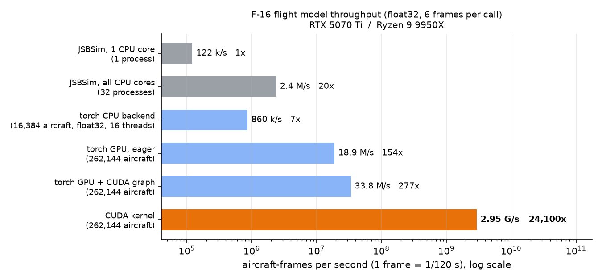

# jsbsim-f16-cuda

**JSBSim's F-16 as a hand-written CUDA kernel: 2.95 billion aircraft-frames per second on
one GPU, checked frame by frame against JSBSim.**

[](LICENSE)


· [한국어](README.ko.md)

The F-16 model that ships with JSBSim 1.3.0 (`f16.xml` flight control system and
aerodynamics, F100-PW-229 engine, fuel tanks, 6-DOF equations of motion with JSBSim's
integrators and Earth rotation) ported to CUDA C++.  One thread flies one aircraft; one
kernel launch advances every aircraft by any number of 1/120 s physics frames.  The kernel
body is hand-written; its constants and coefficient tables are generated in Python from the
model's own data, and the source is compiled at runtime with NVRTC — no build step.  It is
for workloads that fly the same model billions of times (reinforcement learning, Monte
Carlo, optimisation), where one GPU can stand in for a CPU cluster without giving up
JSBSim's numbers.

## Simulator throughput (physics only)

v0.2.1 on an RTX 5070 Ti and a Ryzen 9 9950X (16 cores / 32 threads); float32, 6 frames per
call, GPU otherwise idle ([conditions and all numbers](docs/benchmarks.md)):

- **2.95 billion aircraft-frames/s** from the CUDA kernel with 262,144 aircraft — enough to
  fly **24 million F-16s in real time** on one GPU.
- **24,100× JSBSim on one CPU core, 1,240× JSBSim on all 32 hardware threads** (CUDA kernel
  vs. JSBSim `run()`, physics only).
- **Control surfaces identical to JSBSim** in a one-frame comparison (error 0).



| simulator | aircraft-frames/s | cost per aircraft-frame | vs. JSBSim 1 core (physics only) |
|---|---|---|---|
| JSBSim 1.3.0, 1 process | 122 k | 8.2 µs | 1× |
| JSBSim 1.3.0, 32 processes | 2.38 M | 0.42 µs | 20× |
| torch CPU backend, 16,384 aircraft, 16 threads | 0.86 M | 1.2 µs | 7.0× |
| torch GPU backend + CUDA graph, 262,144 aircraft | 33.8 M | 30 ns | 277× |
| **CUDA kernel, 262,144 aircraft** | **2.95 G** | **0.34 ns** | **24,100×** |

Cost = 1 / throughput (amortised over the batch).  One 20 Hz decision step (6 frames) costs
6× that: 49 µs of JSBSim on one core versus 2.0 ns in the kernel, per aircraft.

## What it means for training

These numbers are for the simulator only; how much a training run speeds up depends on the
rest of your pipeline.  With `T_rest` the time spent on policy inference, observations,
rewards and the learning algorithm:

`speedup = (T_sim_old + T_rest) / (T_sim_new + T_rest)` — if the simulator is a fraction
`p` of your current training time, the speedup is at most `1 / (1 − p)`.

One example, not a guarantee (measured with earlier builds) — the same private PPO trainer
(256×2 MLP policy) on the same PC, first with JSBSim on the CPU, then with this simulator on
the GPU (torch backend + CUDA graph):

| training pipeline | env-steps/s, end-to-end | vs. CPU pipeline |
|---|---|---|
| JSBSim 1.3.0, 28 worker processes (SB3 `SubprocVecEnv`); rollout on CPU, updates on GPU | ≈ 4,200 | 1× |
| GPU simulator, 65,472 parallel environments, minibatch 65,536 (full-iteration benchmark) | 525,692 | 125× |
| same, long training run (extra network updates per iteration) | ≈ 317,000 | ≈ 76× |

An env-step is one decision step of one two-aircraft episode (2 aircraft × 6 physics frames).
The 125× is end-to-end, not the physics alone: most of it comes from what a GPU simulator makes
possible — tens of thousands of parallel environments and large minibatches — while the physics
was already a small share of each step.  Switching that physics to the CUDA kernel later (in a
larger 1024×2-policy pipeline) cut an iteration from about 19.0 s to about 15.6 s and left the
physics at about 0.2 % of it.  [Details](docs/benchmarks.md#simulator-vs-end-to-end-training).

## Quick start

```bash
pip install torch --index-url https://download.pytorch.org/whl/cu128   # any CUDA build of torch
git clone https://github.com/juyoung020/jsbsim-f16-cuda && cd jsbsim-f16-cuda
pip install -e .                        # add jsbsim==1.3.0 to run the verification tools
```

```python
import math, torch
from jsbsim_f16_cuda import F16Stick, attach_stick

N = 65536
dyn = F16Stick(N, device="cuda")              # latitude 0, 3,000 lb fuel, JSBSim defaults
attach_stick(dyn)                             # step() now runs the CUDA kernel
pos_ned = torch.zeros(N, 3, device="cuda"); pos_ned[:, 2] = -20000 * 0.3048   # m, down = -altitude
ok = dyn.reset(pos_ned, psi=torch.rand(N, device="cuda") * 2 * math.pi,
               vt_ms=torch.full((N,), 450 * 0.514444, device="cuda"))        # level trim
stick = torch.tensor([0.0, 0.3, 0.0, 0.9], device="cuda").expand(N, 4)      # ail, ele, rud, thr
for _ in range(200):
    dyn.step(stick, substeps=6)               # = 6 x JSBSim set_controls(); run()
state = dyn.state()                           # pos_ned, euler, uvw, pqr, alpha, beta, fuel, ...
```

The first `attach_stick` compiles the kernel (a few seconds) and caches it on disk.  Inputs
are raw sticks (aileron, elevator, rudder in [−1, 1], throttle in [0, 1]); there is no
flight-control automation on top.  Full API: [docs/api.md](docs/api.md).

## Backends

The three backends share the same state tensors and equations; switching is one call.

- **CUDA kernel** — `attach_stick(dyn)`.  For throughput: one launch per step, state held in
  registers across substeps.
- **torch on GPU** — `F16Stick(..., device="cuda")`, optionally captured in a CUDA graph.  The
  reference implementation of the kernel; read or change the model in Python.
- **torch on CPU** — `F16Stick(..., device="cpu")`.  For machines without a GPU.  Per thread it
  passes one JSBSim core from about 1,000 aircraft, but JSBSim on every core is still faster.

PyTorch provides the tensor interface, CUDA graphs and the reference implementation, and it
ships the NVRTC compiler the kernel is built with — no CUDA toolkit or C++ compiler needed.

## Accuracy vs JSBSim

JSBSim 1.3.0 is flown to mid-flight, its complete state (including integrator history and
FLCS delay buffers) is copied into this plant, and both advance **one frame** on the same
stick inputs.  Maximum error over 13 input programs × 4 flight conditions, float64:

| quantity | torch backend | CUDA kernel |
|---|---|---|
| elevator, aileron, rudder deflection | 0 | 0 |
| u̇, v̇, ẇ (ft/s²) | 7.2e-6, 2.1e-5, 1.4e-4 | same |
| ṗ, q̇, ṙ (rad/s²) | 1.2e-7, 1.4e-8, 4.4e-9 | same |
| thrust (lbf), N2 (%) | 3.4e-6, 1.6e-9 | same |
| mass, inertia (200 random tank loads) | ≤ 3e-11 relative | same |
| kernel vs. torch, every state, per step | — | 5.3e-14 relative |

The same comparison with one real bug fix removed on purpose (`--negative`) fails, as it
should.  Reproduce: `pip install jsbsim==1.3.0 && python -m jsbsim_f16_cuda.fdm_verify --check --fused`.
Method, float32 and latitude results, trim and mass checks: [docs/verification.md](docs/verification.md).
Long trajectories are not a fidelity measure — JSBSim diverges from *itself* by kilometres
within a few hundred seconds when the initial speed changes by 1e-6 kt.

## Limitations

- **One aircraft type**: the F-16 bundled with JSBSim 1.3.0.  This is not the JSBSim engine;
  other aircraft files do not run.
- Landing gear fixed down (the state JSBSim loads it in); no ground contact, wind or
  turbulence; standard atmosphere only.
- Fuel: no transfer or jettison; the engine keeps running when the tanks are empty
  (JSBSim shuts it down).
- `reset()` starts from level trim only, interpolated from a JSBSim trim table
  (0 – 45,000 ft, 150 – 800 kt); between grid cells where a schedule bends, a trimmed aircraft
  can drift tens of feet in 10 s.
- Flat Earth around a reference latitude with rotation terms; drifts from JSBSim's round
  Earth tens of kilometres from the origin.
- The kernel needs an NVIDIA GPU and `integrator="jsbsim"`; float32 differs from float64 at
  rounding level.

## Docs

- [docs/api.md](docs/api.md) — `F16Stick`, `reset`, `step`, `state`, stick conventions, CUDA graphs
- [docs/benchmarks.md](docs/benchmarks.md) — every measurement, batch by batch, and how to rerun
- [docs/verification.md](docs/verification.md) — the frame-by-frame method and all results
- [docs/porting_notes.md](docs/porting_notes.md) — the silent pitfalls found while porting

## License and credits

GPL-3.0-or-later ([LICENSE](LICENSE)).  Derived from
[JSBSim](https://github.com/JSBSim-Team/jsbsim) (LGPL-2.1): equations of motion, integrators,
mass, engine and auxiliary calculations; and from its F-16 model `aircraft/f16/f16.xml`
(Erik Hofman, GPL) and `engine/F100-PW-229.xml`: flight control logic and coefficient tables
(`f16_tables.npz` is extracted from these files).  As its header says, the F-16 model was
built from public data and is unrelated to the manufacturer.
